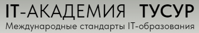

# Цифровая кафедра

– это кафедра дополнительного образования с направлениями по цифровизации страны. В рамках данного репозитория расположены выполненные практические задания по направлению "Искусственный интеллект. Алгоритмы машинного обучения на языке Python" для университета ТУСУР.

## Разделы:

1) Структуры данных и алгоритмы
2) Введение в язык Python
3) Переменные и простые типы данных в Python
4) Операторы и выражения в Python
5) Поток команд
6) Введение в машинное обучение. Часть 1
7) Введение в машинное обучение. Часть 2
8) Введение в машинное обучение. Часть 3
9) Основы теории баз данных и языка SQL
10) Методы работы с данными
11) Регрессия
12) Оценка алгоритмов

## Выполнял:
Студент группы 739-1

Васильев Егор
